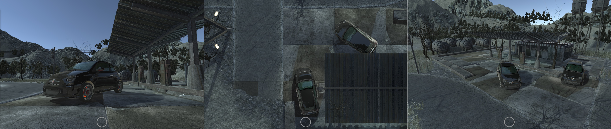

# Car Photographer

**Note:** This project is dead. 💀

See `Documentation` folder for screenshots and proposed architecture.

## Project goals

- Capture screenshots of high-quality vehicles and environments.
- Allow adjustments for time of day and camera position.
- Allow adjustments for vehicle ride-height, wheel angle, paint colour, etc.

Note that only a basic framework has been implemented at this point.

## Content

### Vehicle Model

Currently in the project is a high-quality Fiat 500 Abarth model. This can be found at `Assets/Third-Party/Assetto Corsa`

This was extracted from the [Assetto Corsa](https://store.steampowered.com/app/244210/Assetto_Corsa/) game files using the open-source [KN5 Converter](https://github.com/RaduMC/kn5-converter). A copy of this utility is included in the project at `Assets/Plugins/kn5-converter`.

### Environment

Currently the only full environment included is the ghost town plugin available on the Unity Asset Store. See [Assets/Third-Party/HorrorEnvironment_GhostTown](Assets/Third-Party/HorrorEnvironment_GhostTown/README.md)